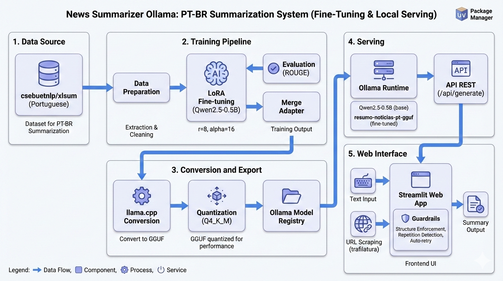

# Agente de Sumarização de Notícias PT-BR com Ollama + Streamlit

<p align="left">

  <!-- Python -->
  

  <!-- UV -->
  

  <!-- Streamlit -->
  

  <!-- Ollama -->
  

  <!-- Transformers -->
  

  <!-- LoRA -->
  

</p>

Este projeto implementa um pipeline completo de fine-tuning para sumarização de notícias gerais em português brasileiro (PT-BR), com serving local via Ollama e interface web interativa em Streamlit.

O sistema permite:
- Treinar um modelo de linguagem com LoRA para resumir notícias em PT-BR
- Exportar o modelo fine-tuned para GGUF e servir via Ollama
- Interface web para gerar resumos a partir de texto ou URL (scraping)
- Comparação lado a lado entre modelo base e modelo fine-tuned

## 📌 Dataset

- **Fonte:** `csebuetnlp/xlsum` (split `portuguese`)
- **Domínio:** Notícias gerais em português brasileiro
- **Pré-processamento:** Limpeza, filtragem por tamanho, formatação instruction-tuning

## Arquitetura do Sistema

O desenvolvimento segue uma arquitetura modular:

- **Pipeline de Treinamento:** Preparo de dados → Fine-tuning LoRA → Avaliação ROUGE → Merge de adapter
- **Conversão:** HuggingFace → GGUF (via llama.cpp)
- **Serving:** Ollama com modelo customizado
- **Frontend:** Streamlit com modo texto e URL (scraping)



## 📂 Estrutura do Projeto

```bash
news-summarizer-ollama/
├── apps/
│   └── streamlit-ui/           # Frontend Streamlit
│       ├── app.py              # Interface principal
│       └── pyproject.toml      # Dependências do app
│
├── packages/
│   ├── training/               # Pipeline de treinamento
│   │   └── src/training/
│   │       ├── prepare_data.py # Preparo do dataset
│   │       ├── train.py        # Treinamento LoRA
│   │       ├── evaluate.py     # Avaliação ROUGE
│   │       └── merge_and_export.py
│   │
│   └── serving/                # Scripts de serving
│       ├── Modelfile           # Configuração Ollama
│       ├── Modelfile.gguf      # GGUF para Ollama
│       ├── convert_to_gguf.sh  # Conversão
│       └── src/serving/
│           ├── smoke_test.py   # Teste de geração
│           └── compare_models.py
│
├── configs/
│   ├── data.yaml               # Configuração de dados
│   ├── train.yaml              # Configuração de treino
│   └── ollama.yaml             # Configuração Ollama
│
├── scripts/
│   ├── check_env.sh            # Validação de ambiente
│   └── run_training_pipeline.sh
│
├── artifacts/
│   ├── checkpoints/            # Checkpoints de treino
│   ├── adapter/                # Adapter LoRA
│   ├── merged/                 # Modelo mergeado
│   ├── gguf/                   # Arquivos GGUF
│   └── reports/                # Métricas e relatórios
│
├── data/
│   ├── raw/                    # Dados brutos
│   └── processed/              # Dados processados
│
├── pyproject.toml              # Workspace UV
├── uv.lock
├── .gitignore
└── README.md
```

## Getting Started

### Requisitos

- Python 3.11+
- UV package manager
- GPU NVIDIA com CUDA funcional (testado: GTX 1080 8GB)
- Ollama instalado localmente
- llama.cpp compilado (para conversão GGUF)

### Instalação

Clone o repositório:
```bash
git clone https://github.com/seu-usuario/news-summarizer-ollama
cd news-summarizer-ollama
```

Instale as dependências:
```bash
uv sync --all-packages
```

### Pipeline Completo

```bash
# 1) Validar ambiente
./scripts/check_env.sh

# 2) Preparar dados
uv run --package training python -m training.prepare_data --config configs/data.yaml

# 3) Treinar LoRA
uv run --package training python -m training.train --config configs/train.yaml

# 4) Avaliar
uv run --package training python -m training.evaluate --config configs/train.yaml

# 5) Merge adapter
uv run --package training python -m training.merge_and_export \
  --train-config configs/train.yaml \
  --ollama-config configs/ollama.yaml

# 6) Converter para GGUF
export LLAMA_CPP_DIR=/caminho/para/llama.cpp
./packages/serving/convert_to_gguf.sh

# 7) Criar modelo Ollama
ollama create resumo-noticias-pt-gguf -f packages/serving/Modelfile.gguf

# 8) Iniciar interface
uv run --package streamlit-ui streamlit run apps/streamlit-ui/app.py
```

## 🔑 Variáveis de Ambiente

Opcionalmente, configure via variáveis de ambiente:

```bash
export OLLAMA_MODEL="qwen2.5:0.5b"          # Modelo padrão
export OLLAMA_BASE_URL="http://localhost:11434"
```

## 🖥️ Interface Streamlit

A interface oferece:

- **Modo Texto:** Cole notícias diretamente
- **Modo URL:** Extraia automaticamente de links (scraping com trafilatura)
- **Estilos de resumo:** Curto (2-3 frases), Médio (1 párrafo), Detalhado (2 párrafos)
- **Comparação:** Veja lado a lado base vs fine-tuned
- **Controle automático:** Limites de tokens e detecção de repetição

## 🧠 Funcionamento dos Modelos

**Modelo Base:** `Qwen2.5-0.5B-Instruct`

> - Modelo pré-treinado da Qwen (Alibaba)
> - Boa capacidade geral em PT-BR
> - Rápido e leve (~397MB)

**Modelo Fine-tuned:** `resumo-noticias-pt-gguf`

> - Adapter LoRA treinado com ~600 amostras do xlsum PT-BR
> - Otimizado para resumir notícias em português
> - Aderência ao formato solicitado

## ✨ Funcionalidades

> * Fine-tuning com LoRA (baixo consumo de VRAM)
> * Avaliação automática com ROUGE-1/2/L
> * Export GGUF com quantização
> * Serving local via Ollama
> * Interface web responsiva
> * Entrada por texto ou URL (scraping)
> * Guardrails: controle de tamanho, detecção de repetição, retry automático
> * Comparação lado a lado de modelos

## 🧪 Qualidade de Código

O projeto utiliza:

```bash
# Verificar sintaxe
uv run --package streamlit-ui python -m py_compile apps/streamlit-ui/app.py

# Executar testes de smoke
uv run --package serving python -m serving.smoke_test
```

## 📊 Métricas de Avaliação

O pipeline de treino gera relatórios em `artifacts/reports/`:

- `train_metrics.json` - Métricas de treino (loss, learning rate)
- `eval_report.json` - Scores ROUGE no conjunto de validação

## 🚀 Próximos Passos

Possíveis evoluções:

- [ ] Batch mode (múltiplas notícias)
- [ ] API REST com FastAPI
- [ ] Histórico de resumos
- [ ] Avaliação automática com benchmark fixo
- [ ] Agregador por tema

## 📄 Licença

MIT License - sinta-se livre para usar e modificar.
